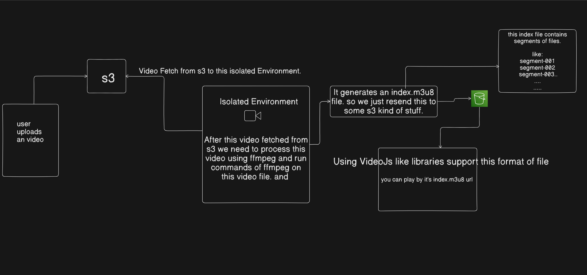

# 🎬 HLS Video Streaming Application

This project allows users to upload video files via a React frontend, processes them into HLS streams using FFmpeg on the backend, and stores the results in AWS S3. It uses Docker for containerization and SQS for asynchronous processing.

---

## 🧱 Tech Stack

- **Frontend**: React + TypeScript + TailwindCSS
- **Backend**: Node.js + Express + Multer + FFmpeg
- **Cloud**: AWS S3 (storage), SQS (message queue)
- **Containerization**: Docker & Docker Compose

---

## ⚙️ Architecture Overview

[React Frontend] --> [Express API] --> [SQS Message Queue] --> [Worker w/ FFmpeg]
|
[S3 Upload]
|
[HLS Video Access]

